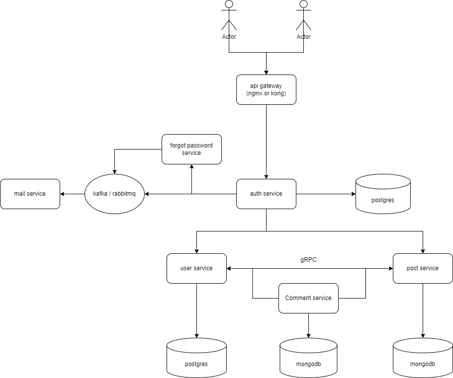

# Blog Microservices

Implementation Microservice in Golang

## Tech Stack

- Go
- gRPC
- Docker
- Kubernetes (optional)
- PostgreSQL
- MongoDB
- Redis
- Apache Kafka / RabbitMQ
- NGINX

## Microservices Architecture

## Features

- [ ] Auth Service
  - [x] Register
  - [x] Login
  - [ ] Logout
  - [ ] Refresh Token
  - [ ] Verify Email
  - [ ] Get my profile
- [ ] User Service
  - [x] Find All Users
  - [x] Find User By ID
  - [x] Find User By Email
  - [x] Insert User
  - [x] Update User
  - [x] Delete User
- [ ] Post Service
  - [ ] Insert Post
  - [ ] Update Post
  - [ ] Delete Post
  - [ ] Find Post By ID
  - [ ] Find All Posts
- [ ] Comment Service
  - [ ] Insert Comment
  - [ ] Update Comment
  - [ ] Delete Comment
  - [ ] Find All Comments By Post ID
- [ ] Mail Service
  - [ ] Send Email
- [ ] Forgot Password Service
  - [ ] Update Password
